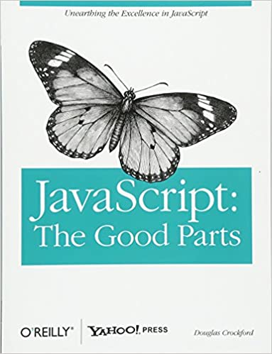

# Hi there! 

My name is Shakh and I'm a web developer living in Uzbekistan. My current focus is full-stack web development - mainly with React, NodeJS and related technologies.

### :metal: About me
  - 2+ years of experience as a software engineer.
&nbsp;

[site]: https://dev-shakh.herokuapp.com/

### :sunrise_over_mountains: Hobbies
- table tennis, chess & I am incredibly interested in solving complex and non-trivial problems. 
&nbsp;

### :dart: Future goals
- I'd like to help others get into software development.  It seems like a common concern is that people don't know how to get started, or no one will hire them without IT experience so I'd like to share some strategies to get past those roadblocks. 
&nbsp;

### :eyes: Nerdy stuff...  
```javascript
const shakh = {
    codingLanguages: [
      'JavaScript', 'TypeScript', 'GO',
      '...and some obsolete ones I`m embarrassed to admit',
    ],
    technologies: [
      'Front: React, Redux-thunk, Redux-saga, webpack, styled-components, Sass, Less',
      'Back: NodeJS, Express, MongoDB, Golang',
      'others: RestAPI, Websockets, git, OAuth/OIDC' 
    ],
    architecture: [
      'Single page applications', 'Microservices', 'MVC',
      'Serverless architecture', 'Progressive web applications',
    ],
    currentSideProjects: [
      'Working on the chat application (NeuraChat)!',
    ],
    askMeAbout: ['web dev', 'coding', 'tech'],
    funFacts: 'I tried teaching kids math for a while... it`s much harder than it looks! :)',
};
```

📊 This Week I Spent Time On

```text
💬 Programming Languages: 
Javascript               25 hrs              ███████████████░░░░░░░░░░   62.5% 
Golang                   5 hrs               ███░░░░░░░░░░░░░░░░░░░░░░   12.5% 
Java                     2 hrs               █░░░░░░░░░░░░░░░░░░░░░░░░   5.0%

🔥 Editors: 
VS Code                  35 hrs              █████████████████████████   100.0%

🐱‍💻 Projects: 
Unknown Project          25 hrs              ███████████████████░░░░░░   75.0% 
Personal Project         5 hrs               ███░░░░░░░░░░░░░░░░░░░░░░   12.5% 
Self-study               5 hrs               ███░░░░░░░░░░░░░░░░░░░░░░   12.5%
```
### :book: Favorite books

<hr />

<hr />

<hr />

<hr />

&nbsp;

